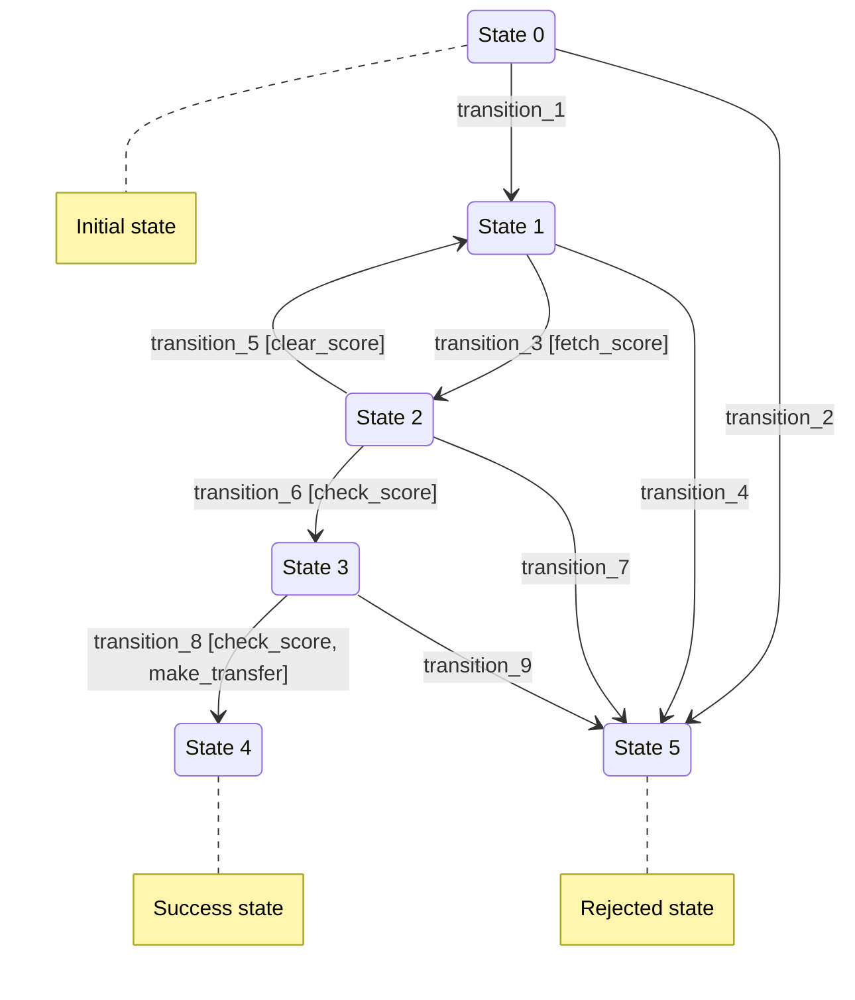

```mermaid
stateDiagram-v2
    state0: State 0
    state1: State 1
    state2: State 2
    state3: State 3
    state4: State 4
    state5: State 5

    state0 --> state1: transition_1
    state0 --> state5: transition_2

    state1 --> state2: transition_3 [fetch_score]
    state1 --> state5: transition_4

    state2 --> state1: transition_5 [clear_score]
    state2 --> state3: transition_6 [check_score]
    state2 --> state5: transition_7

    state3 --> state4: transition_8 [check_score, make_transfer]
    state3 --> state5: transition_9

    note right of state0: Initial state
    note right of state4: Success state
    note right of state5: Rejected state
```
