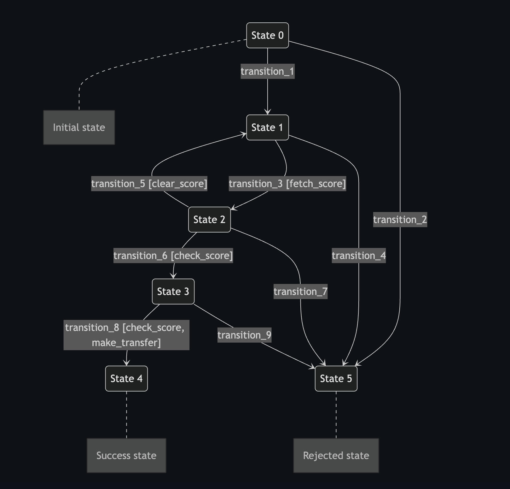

<p align="center"><a>

</a></p>

## Description

A simple credit core backend implementation using FastAPI as the main framework and a modular and hexagonal software architecture. The system manages users, accounts, and credit requests with a state machine for credit request processing.

## Architecture

The system follows a hexagonal (ports and adapters) architecture with a clear separation of concerns:

### Core Layers:

- **Controllers**: Handle HTTP requests and responses (REST and GraphQL endpoints)
- **Services**: Contain business logic and orchestration
- **Repositories**: Data access layer for database operations

### Module Organization:

- **User**: User management and authentication
- **Account**: Bank accounts associated with users
- **Credit Request**: Credit applications and state transitions
- **Heart Beat**: System health check endpoint

### Technical Components:

- **Middleware**: Error handling, logging, and request contextualizing
- **Database**: MySQL with SQLModel ORM
- **API Formats**: Dual REST and GraphQL interfaces
- **Internationalization**: Multi-language support (en_US, es_CO)
- **Logging**: Structured and pretty logging options
- **Caching**: TTLCache implementation for database queries

### Data Flow:

1. Request enters through REST or GraphQL controller
2. Controller validates input and calls appropriate service
3. Service orchestrates business logic using repositories
4. Repository interacts with database (with caching)
5. Response flows back to client through controller

## Postman Collection

The system exposes the following endpoints:

### REST Endpoints:

available potsman collection at: `docs/postman/credit_core_system.postman_collection.json`
available swagger at: `docs/swagger/swagger.json`

#### Heart Beat

- `POST /rest/heart-beat/`: System health check

#### User Management

- `POST /rest/user/create`: Create a new user
- `POST /rest/user/authenticate`: Authenticate a user
- `POST /rest/user/search-by-email`: Find user by email address
- `POST /rest/user/search-by-id`: Find user by ID
- `POST /rest/user/search-by-document`: Find user by document number

#### Account Management

- `POST /rest/account/create`: Create a new account for a user
- `POST /rest/account/search-by-id`: Find account by ID
- `POST /rest/account/search-by-user-id`: Find all accounts for a specific user

#### Credit Request Management

- `POST /rest/credit-request/create`: Create a new credit request
- `POST /rest/credit-request/search-by-id`: Find credit request by ID
- `POST /rest/credit-request/search-by-user-id`: Find credit requests by user ID
- `POST /rest/credit-request/search-by-account-id`: Find credit requests by account ID
- `POST /rest/credit-request/search-by-status`: Find credit requests by status

#### Credit Request Transitions

- `POST /rest/credit-request-transition/make-transition`: Change the status of a credit request using a transition code

### GraphQL Endpoints:

available potsman collection at: `docs/postman/credit_core_system.postman_collection.json`

#### User Queries

- `getUserByFilters`: Flexible user search with email, name, document, etc.

#### Account Queries

- `getAccountByFilters`: Flexible account search with account ID, user ID, etc.

#### Credit Request Queries

- `getCreditRequestByFilters`: Flexible credit request search with requestId, userId, requestStatus

## Execution Dependencies

- Node: 18.20.3(Optional)
- NPM: 10.7.0(Optional)
- Docker: 28.1.1
- Postman

## Docker Execution Instructions

The project can be deployed locally using a docker command or an npm shortcut.

Using just docker:

```shell
docker compose -f docker_compose/microservice/deploy.full.yaml up
```

Using docker and npm:

```shell
npm run docker-start
```

After that you are able to

## Local Dependencies

- Node: 18.20.3
- NPM: 10.7.0
- Python: 3.13.5
- Poetry: 1.8.5
- Docker: 28.1.1
- Postman

## Local Execution Instructions

First install mysql if not installed

After installing mysql you would need a new db called `credit_system_db`

Run on the new db all the `migrations/mysql_database` scripts by date order

After having ready the db you would need to install Node, NPM, Python and Poetry if not installed

Here some installation manuals if needed

- [**node+npm**](https://nodejs.org/en/download)
- [**python**](https://wiki.python.org/moin/BeginnersGuide/Download)
- [**poetry**](https://python-poetry.org/docs/#installation)

After that run the next commands in order

```shell
npm install
```

```shell
poetry install
```

Now we need to setup the .env.example dont customize the .env the repo will overwrite the .env with the .env.example content anyway

And now with the db running we are ready to go

```shell
npm run start
```

## Testing The Proyect

1. First create a user with the user creation endpoint `POST /rest/user/create`

2. After creating the user we need to validate the user after creating a new account cliadte the user with `POST /rest/user/authenticate`

3. Now we can create a new account for the user for that use `POST /rest/account/create`

4. And after having an account we can create a credit request `POST /rest/credit-request/create`

5. After creating the credit request we can move the status across the approva flow using `POST /rest/credit-request-transition/make-transition`

The status and the transitions are described in the next diagram and in all flow moment you could use the other rest or graphql endpoints available at postman collection to check if the data is changing or not

- State 0: created
- State 1: ready to be score
- State 2: scored
- State 3: ready to be payd
- State 4: payd
- State 5: canceled



The states machine that directs the flow is part of the credt request module and is available at `src/modules/credit_request/static/credit_request_states_machine.json`
